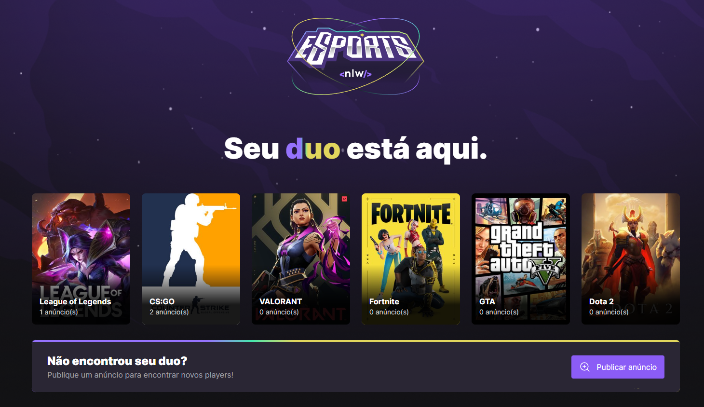

<h1 align="center"> Nlw eSports </h1>

Evento exclusivo e gratuito, promovido pela Rocketseat para ensino de tecnologias WEB.

  <a href="#-tecnologias">Tecnologias</a>&nbsp;&nbsp;&nbsp;|&nbsp;&nbsp;&nbsp;
  <a href="#-projeto">Projeto</a>&nbsp;&nbsp;&nbsp;|&nbsp;&nbsp;&nbsp;
  <a href="#-layout">Layout</a>&nbsp;&nbsp;&nbsp;|&nbsp;&nbsp;&nbsp;
  <a href="#memo-licença">Licença</a>

  

 

  

  

## 🚀 Tecnologias

Esse projeto foi desenvolvido com as seguintes tecnologias:

# Front-end Web

- HTML e CSS
- ReactJS
- TypeScript
- [TailwindCSS](https://tailwindcss.com/)
- [Vite](https://vitejs.dev/)
- [Radix](https://www.radix-ui.com/)
- [Axios](https://axios-http.com/)
- [React-router v6.4.2](https://github.com/remix-run/react-router)
- [phosphor-react](https://phosphoricons.com/)

## Backend

- Express
- [Prisma](https://www.prisma.io/)

## Mobile

- React Native
- Expo
- TypeScript
- [phosphor-react-native](https://phosphoricons.com/)

## 💻 Projeto

O NLW eSports é um aplicativo web e mobile onde jogadores podem se encontrar para combinar de jogar algumas partidas, onde mostra os jogos que estão em alta para encontrar um Duo e bater aquela gameplay

## 🔖 Layout

Você pode visualizar o layout do projeto através [DESSE LINK](https://www.figma.com/file/gpqavL469k0pPUGOmAQEM9/Explorer-Lab-%2301/duplicate). É necessário ter conta no [Figma](https://figma.com) para acessá-lo.

## 🚧 Features

- Responsivo
- Carrosel nos games
- Component de Select Radix
- Validação (react-hook-form)
- Autenticação: com o Google ✔️

## :memo: Licença

Esse projeto está sob a licença MIT.

---

Feito com ♥ by Rocketseat :wave: [Participe da nossa comunidade!](https://discord.gg/rocketseat)
